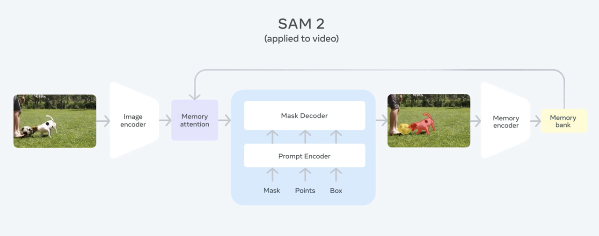

# Overview

This is a repository for the CMU SAM2 project. In this project, I first take a sample image and its corresponding mask, then use them to generate masks for the rest of the images in the dataset. I use the SAM2 model to generate these masks and the `pycocotools` library to evaluate the performance.

# Requirements

- Requires `uv` for package management. Install it using `curl -LsSf https://astral.sh/uv/install.sh | sh`.
- Requires `python 3.12`.

# Usage

- `uv sync` to install all dependencies.
- `uv run main.py` to run the tracking script.
- `uv run evaluation.py` to evaluate the masks and generate reports.

# Dataset

The dataset is available at `products/`. It consists of various product images and their corresponding masks.

> Note: I only use the first image's mask to create the embedding and hone the zero-shot capabilities of SAM2. All other masks are used for evaluation purposes only.

# Web Dashboard

The `hf` directory contains the code for the Gradio dashboard used for deployment. You can access the working web app directly here: [SAM2-CMU on Hugging Face](https://huggingface.co/spaces/shantanuuchak/sam2-cmu)

> **IMPORTANT**: The `hf` directory is for deployment purposes only and should not be taken into consideration for the main project logic or evaluation.